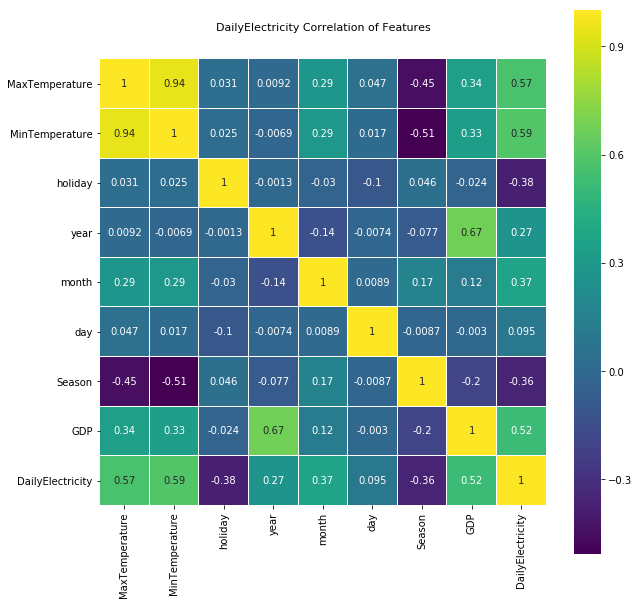

# Monthly-Electricity-forecast use GPR-RFr
某区域月电量预测，采用高斯过程回归、随机森林回归预测日电量，通过日电量累加的方式来获得月电量的预测  
# Data Set
Date	DailyElectricity	MaxTemperature	MinTemperature	Season	GDP	holiday	MonthElectricity  
其中MonthElectricity是该月电量，DailyElectricity是当日电量，其余为输入特征
# Correlation of Features

# 步骤：
```
一、下载数据  
在res目录中下载  
二、特征变量相关性 
观察特征变量之间的相关性，并给出正态分布图
三、正态分布图  
四、Scale+PCA预处理  
数据归一化后用PCA降维消除特征间的相关性
五、算法模型  
1.RFr  
RFr+k折交叉验证
2.GPR 
六、月电量预测  
简单的采用日累加的方法  

```
# 输入说明：
要求用户在存入本月后五天以及次月所有天数的模型所需特征数据。举例：本月为9月，则用户需要给定9月剩余5天的特征数据一加10月31天的特征数据作为输入。即在数据库中，必须完整录入整个月的特征数据才能完成预测。 
具体如下：  
本月后五天数据，每条数据必须包括：  
最高最低温度（可用接口填入）、是否节假日、年、月、季节。  
次月所有天数据，每条数据必须包括：  
是否节假日、年、月、季节。  
自动预测模块根据数据格式，自动检测该月的月长度，从而进行预测值切割，为最终月电量预测做准备。
